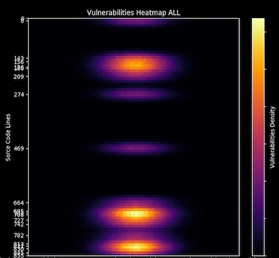

# XRayCode
*Visualizing source code vulnerabilities with heatmaps*




**XRayCode** is a proof of concept written in Python 3 whose main objective is to provide a new approach to visualize the detected vulnerabilities within a program's source code. Independently from the tool that we use to detect the vulnerabilities (in this case we have chosen the Python static code analysis tool called [Bandit](https://pypi.org/project/bandit/), due to its great relevance), **XRayCode** pretends to be a new approach towards a new point of view that helps in a visual way, to the early detection of possible vulnerabilities in the code. For this purpose, it will display an image on the screen (where the rows are the number of lines of code) which will represent a heat map indicating the hotspots where vulnerabilities have been detected. **XRayCode** allows you to work by scanning complete folders, specific files or even remotely located files using their URL. 

Once analysed, we have the option of viewing it directly on screen ( we can zoom in or out here, for example) or directly downloading the images in a specific folder. In this way, just by accessing it we can see in the preview of the images if vulnerabilities have been detected or not. It is also possible to generate a PDF file with a report of the type, level and description of the vulnerabilities found as well as a heatmap capture for each file analyzed.

## Getting started

### Prerequisites

This very first version uses Bandit, to analyse static code written in Python. However, **XRayCode** can read the information from a JSON file, so it is simple to adapt it to another engine of any other programming languages.

**Install Bandit 1.6.2:**

```python
sudo apt install bandit
```

### Dependences

Numpy
```python
pip3 install numpy
```

Seaborn
```python
pip3 install seaborn
```

Fpdf
```python
pip3 install fpdf
```

Tdqm
```python
pip3 install tqdm
```

Requests
```python
pip3 install requests
```

TK
```python
sudo apt-get install python3-tk
```

### Usage

**XRayCode** supports the following commands:

```python
usage: xraycode.py [-h] -i I -o O -l L -r R -s S

Heatmap, X-Ray source code analysis by Ideas Locas CDCO ...

optional arguments:
  -h          show this help message and exit
  -i I        Input folder to scan
  -o O        Output folder to export results
  -l L        Severity (ALL, LOW, MEDIUM, HIGH)
  -r R        PDF file report name
  -s S        Show heatmap in screen (on/ofF)
```

All the parameters are mandatory.

Examples:

#### Scanning for all files (.py) in a specific folder:
```python
python3 xraycode.py -i /FolderToScan -o outputheatmap/ -l ALL -s on -r pdfreport2.pdf
```
    -i Scan folder ("FolderToScan")

    -o Output folder, where the generated images will be placed ("outputheatmap")

    -l "ALL" Specifies  all levels of vulnerabilities together with a single color palette scheme

    -s When set to "on" it activates the direct on-screen display of the heat map

    -r Denotes the file that will be generated containing the PDF vulnerabilities report ("pdfreport.pdf")

#### Checking a single file (.py) located in a specific folder::

```python
python3 xraycode.py -i /FolderToScan/FileToScan.py -o outputheatmap/ -l ALL -s on -r pdfreport2.pdf
```

#### Checking a single file located at a specific URL:
```python
python3 xraycode.py -i https://urltoscan/filetoanalyze.py -o outputheatmap/ -l HIGH -s off -r pdfreport.pdf
```
    -i URL file location ("https://urltoscan/filetoanalyze.py")

    -o Output folder, where the generated images will be placed ("outputheatmap")

    -l "HIGH" Specifies  all levels of vulnerabilities together with a single color palette scheme

    -s When set to "off" they do not display the heat map

    -r Denotes the file that will be generated containing the PDF vulnerabilities report ("pdfreport.pdf")


## Authors

This project has been developed by the team of **Ideas Locas (CDCO - Telefónica)**. 
To contact the author:

  * Fran Ramírez. franciscojose.ramirezvicente@telefonica.com - [@cybercaronte](https://twitter.com/cybercaronte)


## Contributing

Please read [CONTRIBUTING.md](CONTRIBUTING.md) for details on our code of conduct, and the process for submitting pull requests to us.

## License

This project is licensed under the GNU General Public License - see the [LICENSE.md)[LICENSE.md] file for details.

## Disclaimer!

THE SOFTWARE (for educational purpose only) IS PROVIDED "AS IS", WITHOUT WARRANTY OF ANY KIND, EXPRESS OR IMPLIED, INCLUDING BUT NOT LIMITED TO THE WARRANTIES OF MERCHANTABILITY, FITNESS FOR A PARTICULAR PURPOSE AND NONINFRINGEMENT. IN NO EVENT SHALL THE AUTHORS OR COPYRIGHT HOLDERS BE LIABLE FOR ANY CLAIM, DAMAGES OR OTHER LIABILITY, WHETHER IN AN ACTION OF CONTRACT, TORT OR OTHERWISE, ARISING FROM, OUT OF OR IN CONNECTION WITH THE SOFTWARE OR THE USE OR OTHER DEALINGS IN THE SOFTWARE.

This software doesn't have a QA Process.
